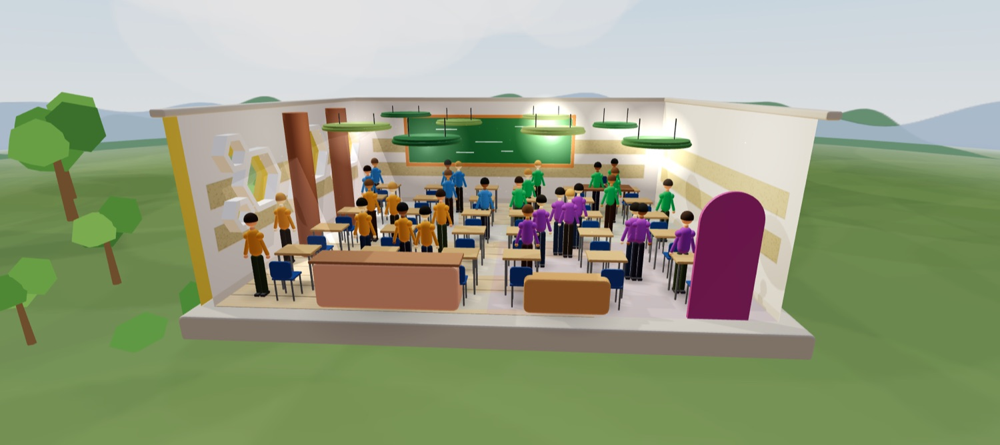
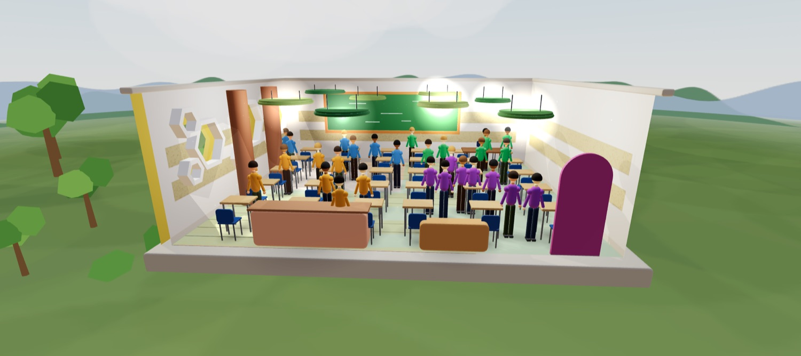

# ⚡ Smart Classroom AI — Gemelo Digital

Un salón de clase que apaga, atenúa o enciende sus luces solo: según cuánta
gente hay, en qué parte del salón está, y cuánta luz entra por la ventana.

El salón no existe. Es un **gemelo digital** en 3D — y ese es justamente el
punto.

**[▶ Ver el proyecto funcionando](https://victolopezhernandez-rgb.github.io/smart-classroom/)**

<p align="center">
  
  
</p>

---

## El problema

Un salón vacío con las ocho lámparas prendidas no es que a nadie le importe: es
que **no es tarea de nadie**. El profesor va de salón en salón, el aseador llega
a las seis.

La respuesta obvia son sensores de movimiento. Pero un sensor de movimiento es
ciego al sol — un salón lleno a mediodía, con luz entrando por la ventana,
prende las luces igual — y no sabe *dónde* está la gente.

Y hay un problema peor: **nadie compra lo que no puede medir primero.** Ningún
rector manda a cablear un salón por una promesa; pregunta cuánto se va a
ahorrar. Y la única forma de responderle sería instalando todo, que es justo lo
que no quiere pagar sin saber.

**No es un problema de tecnología. Es un problema de evidencia.**

Por eso esto no es un controlador de luces: es la herramienta con la que se
decide si vale la pena instalar uno, antes de comprar un solo sensor.

---

## Los 6 agentes

El sistema no es un programa: son seis agentes que se hablan entre sí.

| Agente | Código | Qué hace |
|---|---|---|
| **Orchestrator** | `backend/agents/orchestrator.py` | Cada 5 s le pregunta a todos, decide y transmite |
| **Vision** | `backend/agents/vision.py` | Cuántas personas hay y en qué zona — simuladas o vistas por la cámara |
| **LightSensor** | `backend/agents/light_sensor.py` | Cuánta luz natural entra por zona, según hora y clima |
| **Voice** | `backend/agents/voice.py` | Órdenes, escenas de clase y avisos de emergencia hablados |
| **DigitalTwin** | `backend/agents/digital_twin.py` | El estado del salón y la contabilidad de energía |
| **Emergency** | `backend/agents/emergency.py` | Convierte una alerta en ruta de evacuación iluminada |

El orden de mando importa, y es deliberado:

```
EMERGENCIA  ▸  VOZ  ▸  MOTOR DE REGLAS
```

**La voz manda sobre la comodidad, no sobre la seguridad.** Una orden de luces
no cancela una emergencia; solo la cancela decir explícitamente que ya pasó.

---

## Lo que sabe hacer

**Decide zona por zona, y cada zona deja escrito su porqué.** A mediodía, con
treinta estudiantes adentro, las zonas con ventana se apagan — *"luz natural al
86 %, suficiente"* — y las del fondo siguen encendidas. Mismo salón, misma
hora, la misma gente. Cada decisión queda registrada con su hora y su razón: es
**auditable**.

**Ve de verdad, si se le pide.** El agente de visión puede simular personas o
verlas con la cámara del computador, y se cambia con un interruptor, en vivo.
El modelo de detección corre **dentro del navegador**: ninguna imagen sale del
computador, ni siquiera hacia el servidor — solo viajan dos números por
persona. Si la cámara falla o alguien la tapa, a los 8 segundos vuelve sola a
simulación.

**Entiende lo que va a pasar en la clase, no solo órdenes de luces.** Nadie dice
*"apaga las zonas A y B y atenúa C y D"*. Dice **"vamos a ver una película"** —
y el sistema apaga las de adelante, que son las que lavan la pantalla, y deja
las de atrás atenuadas para poder tomar apuntes. También entiende *"hora de
leer"*, *"nos vamos a descanso"*, *"trabajo en grupo"*, y emergencias dichas
como las dice una persona de verdad: *"hay un incendio"*, *"está temblando"*.

**Traduce el ahorro a algo que signifique algo.** Kilovatios, pesos colombianos
y kilos de CO₂ — con el factor oficial de la UPME, 126 g por kWh.

---

## Cómo correrlo

Necesitas **Python 3.11 o superior**. Nada más: no hay `npm install` ni paso de
compilación, y todo (React, Three.js, el modelo de detección) está incluido en
el repositorio.

```bash
pip install -r backend/requirements.txt
```

```bash
cd backend && python3 -m uvicorn main:app --reload --port 8000
```

Y abre **http://localhost:8000/app/**.

> La cámara necesita `localhost` o HTTPS. Desde una IP como `192.168.x.x` el
> navegador no la habilita.

---

## Cómo está construido

```
NAVEGADOR ──── páginas ────► GITHUB PAGES   (archivos estáticos)
          └─── datos ──────► RENDER         (Python + los 6 agentes)
```

- **Backend:** Python 3.11 · FastAPI · WebSockets
- **Frontend:** React y Three.js servidos desde el propio repositorio,
  compilados en el navegador por Babel. **Sin paso de compilación, sin npm,
  funciona sin internet.**
- **La IA es un motor de reglas**, no una API externa: decide en milisegundos,
  funciona sin conexión y deja escrito por qué hizo lo que hizo.
- **Datos:** JSON para el estado, CSV para el registro de energía.

```
backend/            ← todo lo que corre
├── main.py         rutas, WebSocket, sirve /app y /vendor
├── agents/         los 6 agentes
├── skills/         lógica pura, sin estado
├── routes/         la API REST, un archivo por agente
├── shared/         estado, umbrales, registro, reloj
└── static/         ← la interfaz de verdad
    ├── landing.html
    └── index.html  el gemelo 3D y el tablero
```

---

## Lo que este proyecto **no** es

Esto nunca ha controlado una lámpara real. La cámara sí es real, pero es la
única pieza que lo es: el sensor de luz no mide el sol, lo modela; y al otro
lado no hay ninguna lámpara, hay un modelo 3D. **Los porcentajes de ahorro son
proyecciones de un modelo, no mediciones de un salón físico.**

Lo decidimos así, y no por falta de presupuesto. Un gemelo digital se construye
precisamente para esto: simular antes de construir no es la versión barata de
la ingeniería, es una etapa de la ingeniería. Y estos números no son una
promesa — son un modelo con **todos sus supuestos a la vista**, que cualquiera
puede revisar y cambiar.

El siguiente paso es un salón, dos sensores y un microcontrolador. Ese montaje
no reemplaza al gemelo: **lo calibra**. Y calibrado con un salón real, el gemelo
predice los otros cuarenta sin instalar nada.

---

## Documentación

| Archivo | Qué hay adentro |
|---|---|
| [PROYECTO.md](PROYECTO.md) | **El documento autoritativo.** Qué hace cada archivo hoy, las trampas conocidas, cómo se publica |
| [CLAUDE.md](CLAUDE.md) | El plan de construcción original, actualizado |
| [DEPLOY.md](DEPLOY.md) | Cómo se publica y cómo se actualiza |
| [GUION.md](GUION.md) | El guion de la presentación, cronometrado |
| [PITCH.md](PITCH.md) | Las preguntas del jurado y sus respuestas |

---

## El equipo

Estudiantes de 10mo grado · Feria STEAM 2026

- **Victoria López** — Líder de Proyecto & Desarrollo
- **Manuela Granada** — Contexto Social & Problemática
- **Maria Fernanda Valencia** — Solución & Articulación del Proyecto

---

*Lo que construimos no es un salón: es un método.*
